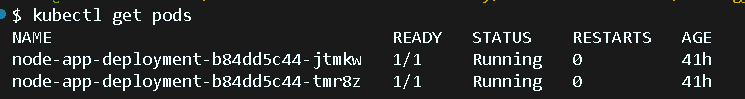
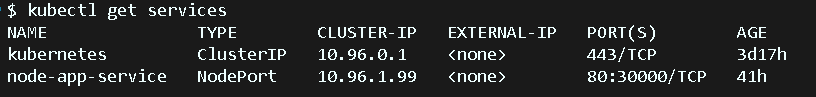
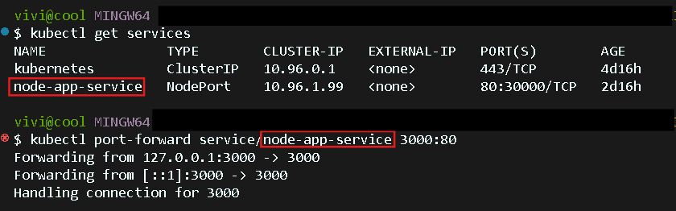
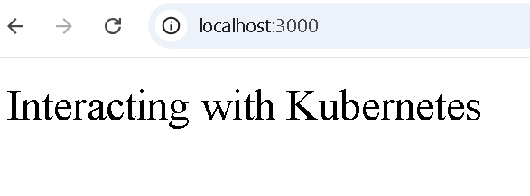

# 6.2C: Interacting with Kubernetes Cluster Using Port Forwarding

This task desmonstrates how to interact with Kubernetes cluster by verifying pod deployment and accessing your app locally through port forwarding.

## **Tools used:**

- **Git** – [https://github.com](https://github.com/) (Version control system)
- **Visual Studio Code** – https://code.visualstudio.com/ (Code editor)
- **Node.js** – https://nodejs.org/en/download/ (Runtime for JavaScript in backend development)
- **Docker** – Containerization platform
- **Kubernetes** – Container orchestration platform and host your microservices
- **Kubectl** – Command-line tool to interact with Kubernetes clusters

### Clone This Repository

```yaml
git clone https://github.com/<your-username>/sit323-2025-prac6c.git
cd sit323-2025-prac6c
```

## **Step-by-step guide**

### 1. Verify Your Application Deployment

Validate that your application is running inside the Kubernetes cluster.

Run the following command to check the pods:

```bash
kubectl get pods
```

This shows all pods in the cluster and should be listed with running status



Then check your services

```bash
kubectl get services
```

You may notice a port mapping such as `80:30000/TCP` for your service `node-app-service`



---

### 2. Access Your Application Using Port Forwarding

Traffic from your local computer will be forward to the Kubernetes service, using the following command:

```bash
kubectl port-forward service/<your-service-name> 3000:80
```

This allows the web browser to interact with the app executing inside Kubernetes.

- Replace `<your-service-name>` with the actual name shown in `kubectl get services`
- `3000` — The local port (you can visit this in your browser)
- `80` — The port exposed by your Kubernetes service



- Port-forward is now working
- it’s now tunneling traffic from my local port 3000 → Kubernetes app

Once forwarded, then you can open your browser and visit:

```yaml
http://localhost:3000
```



You should see your message:

**"Interacting with Kubernetes"**
